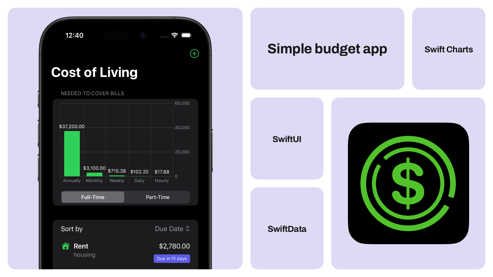

# Simpler Budget: Bill Organizer  
### Financial Calculator

[Simpler Budget: Bill Organizer](https://apps.apple.com/us/app/)

**Meet your new budget bestie.**

**Simpler Budget: Bill Organizer** is the easiest way to track bills and know exactly how much you need to earn to stay on top of life.

This smart financial calculator breaks down your income needs based on your expenses — giving you a clear picture of what you need to earn **yearly, monthly, weekly, daily**, or even **hourly**. Whether you're salaried, hourly, or freelance, you’ll always know your target income.

---

## 🔧 What You Can Do

- 💸 **Add bills once** and get **automatic income targets**
- 📆 View your required income:
  - Annually
  - Monthly
  - Weekly
  - Daily
  - Hourly
- ⏰ Set up **reminders** so you never miss a due date

---

## 🛠️ Built With

- **Swift**
- **SwiftUI**
- **SwiftData**
- **Swift Charts**
- Supports iOS 18.0+
